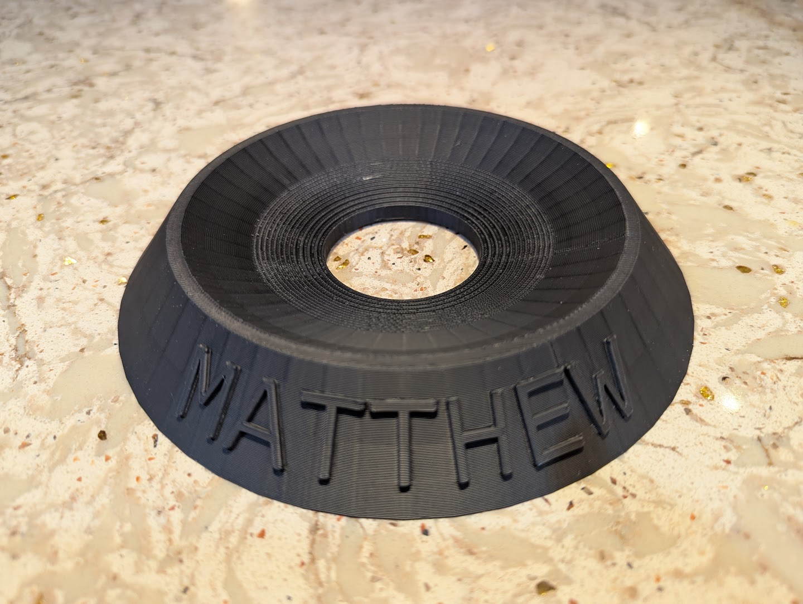

# Bowling Ball Holder with Text
A fully customizable OpenSCAD of a bowling ball holder that can have text put on it! You can change the text, text, depth. Make the text inny or outty. Change the wall thickness, holder height, lip size, and more!

Simply adjust the parameters. I recommend using OpenSCAD to edit.

_Alpha build above_

## Contributors
Matthew Cordaro

_Become a contributor!  Feel free to issue any pull requests for added featurs if you'd like to share._

### Licence
SCAD Bowling Ball Holder with Text © 2025 by Matthew Cordaro is licensed under CC BY-NC-SA 4.0 
