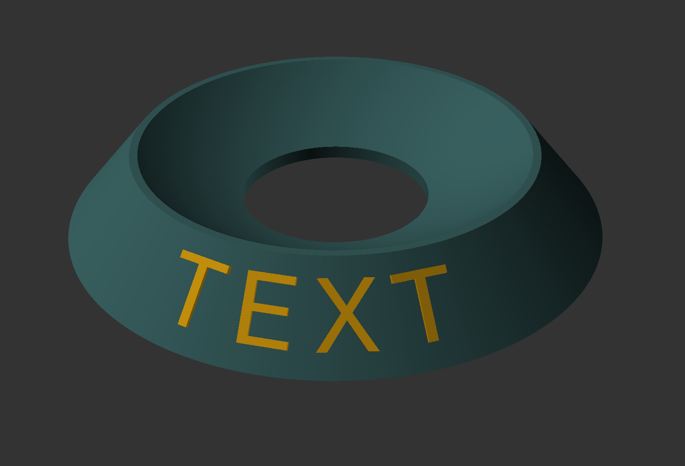

# Bowling Ball Holder with Text

A fully customize-able bowling ball holder with text on it! Change the text depth, make the text inny or outty. Even modify the wall thickness, holder height, lip size, and more!

| SCAD | Alpha Biuld Example | 
| - | - |
|  |  |

## Customize

**It is generally recommend using OpenSCAD**  This way, you may make and view your modifications prior to rendering.  Unfortunately, rendering can take a lot of time because, OpenSCAD is single threaded. 

### OpenSCAD

1. Open `holder.scad`
2. Modify the variable in the file or on the right with the GUI
3. Render it: _F6_ OR _Design➡Render_ (May take a while)
4. Export it: _F7_ for `stl` OR _File➡Export_ and select the file type wanted.

### Command-line

Adjust the parameters in the `holder.json` file, then run the following command: (Replace `stl` with `3mf` or other supported export types)

```
openscad -o holder.stl -p holder.json holder.scad
```

_Note: Name change only?  Use `-D name="TEXT"` in place of `-p holder.json`._


## Contribute

_Become a contributor!  Feel free to issue any pull requests for added features to share._

---

SCAD Bowling Ball Holder with Text © 2025 by Matthew Cordaro is licensed under CC BY-NC-SA 4.0 
